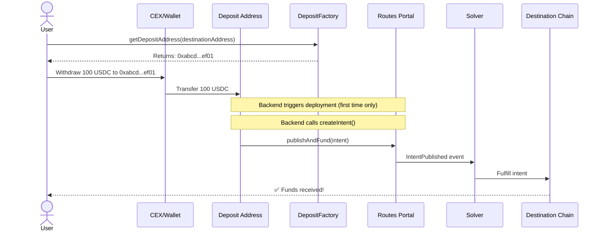

## Overview

The Deposit Address system enables users to initiate cross-chain transfers by simply sending tokens to a deterministic address. This is particularly powerful for CEX withdrawals and wallet transfers where users cannot interact with smart contracts directly.

<Note>
Users only need to complete **two steps**: get a deposit address and send tokens. Everything else happens automatically.
</Note>

## How It Works

### User Flow



### Timeline

- **Deposit detection**: ~30-60 seconds (backend polling)
- **Contract deployment**: ~15 seconds (first time only)
- **Intent creation**: ~15 seconds
- **Solver fulfillment**: ~30-120 seconds
- **Total**: ~2-4 minutes end-to-end

## Architecture

### Factory Pattern

Each `DepositFactory` represents a **specific bridge route** with hardcoded parameters:

```solidity
// Example: Ethereum USDC → Solana USDC
DepositFactory_USDCTransfer_Solana {
    sourceToken: 0xA0b86991c6218b36c1d19D4a2e9Eb0cE3606eB48,  // USDC on Ethereum
    destinationChain: 1399811151,                         // Solana mainnet
    destinationToken: 0xEPjFW...,                         // USDC mint on Solana
    portal: 0x...,
    prover: 0x...,
    deadlineDuration: 3600  // 1 hour
}
```

The only variable parameter is the user's **destination address**.

### Deterministic Addresses (CREATE2)

Deposit addresses are computed deterministically using CREATE2:

```solidity
// From BaseDepositFactory.sol:64-86
function deploy(
    address destinationAddress,
    address depositor
) external returns (address deployed) {
    // Generate deterministic salt
    bytes32 salt = _getSalt(destinationAddress, depositor);
    
    // Deploy using CREATE2
    deployed = DEPOSIT_IMPLEMENTATION.clone(salt);
    
    // Initialize the deployed contract
    _initializeDeployedContract(deployed, destinationAddress, depositor);
    
    emit DepositContractDeployed(destinationAddress, deployed);
}

function getDepositAddress(
    address destinationAddress,
    address depositor
) public view returns (address predicted) {
    bytes32 salt = _getSalt(destinationAddress, depositor);
    return DEPOSIT_IMPLEMENTATION.predict(salt, bytes1(0xff));
}

function _getSalt(
    address destinationAddress,
    address depositor
) internal pure returns (bytes32) {
    return keccak256(abi.encodePacked(destinationAddress, depositor));
}
```

**Key points:**
- Address is computed **before deployment**
- Same inputs always produce the same address
- Users can send funds before contract deployment
- Deployment happens lazily on first use

### BaseDepositAddress Contract

All deposit address implementations inherit from `BaseDepositAddress`:

```solidity
// From BaseDepositAddress.sol:14-80
abstract contract BaseDepositAddress is ReentrancyGuard {
    /// @notice User's destination address (bytes32 for cross-VM compatibility)
    bytes32 public destinationAddress;
    
    /// @notice Depositor address (receives refunds if intent fails)
    address public depositor;
    
    /// @notice Initialization flag
    bool private initialized;
    
    function initialize(
        bytes32 _destinationAddress,
        address _depositor
    ) external {
        if (initialized) revert AlreadyInitialized();
        if (msg.sender != _factory()) revert OnlyFactory();
        if (_destinationAddress == bytes32(0)) revert InvalidDestinationAddress();
        if (_depositor == address(0)) revert InvalidDepositor();
        
        destinationAddress = _destinationAddress;
        depositor = _depositor;
        initialized = true;
    }
    
    function createIntent() external nonReentrant returns (bytes32 intentHash) {
        if (!initialized) revert NotInitialized();
        
        // Get source token from derived contract
        address sourceToken = _getSourceToken();
        
        // Get balance of source token held by this contract
        uint256 amount = IERC20(sourceToken).balanceOf(address(this));
        if (amount == 0) revert ZeroAmount();
        
        // Execute variant-specific intent creation
        intentHash = _executeIntent(amount);
    }
    
    // Template methods implemented by specific variants
    function _factory() internal view virtual returns (address);
    function _getSourceToken() internal view virtual returns (address);
    function _executeIntent(uint256 amount) internal virtual returns (bytes32);
}
```

## Example: USDC to Solana

The `DepositAddress_USDCTransfer_Solana` contract shows how deposit addresses work for Solana destinations:

```solidity
// From DepositAddress_USDCTransfer_Solana.sol:77-129
function _executeIntent(uint256 amount) internal override returns (bytes32 intentHash) {
    // Validate amount fits in uint64 for Solana compatibility
    if (amount > type(uint64).max) {
        revert AmountTooLarge(amount, type(uint64).max);
    }
    
    // Get configuration from factory
    (
        uint64 destChain,
        address sourceToken,
        bytes32 destinationToken,
        address portal,
        address prover,
        bytes32 destPortal,
        bytes32 portalPDA,
        uint64 deadlineDuration,
        bytes32 executorATA
    ) = FACTORY.getConfiguration();
    
    // Encode route bytes for Solana (Borsh format)
    bytes memory routeBytes = _encodeRoute(
        amount,
        destinationToken,
        destPortal,
        portalPDA,
        deadlineDuration,
        executorATA
    );
    
    // Construct Reward
    Reward memory reward = Reward({
        deadline: uint64(block.timestamp + deadlineDuration),
        creator: depositor,  // Refunds go to depositor
        prover: prover,
        nativeAmount: 0,
        tokens: new TokenAmount[](1)
    });
    reward.tokens[0] = TokenAmount({token: sourceToken, amount: amount});
    
    // Approve Portal to spend tokens
    IERC20(sourceToken).approve(portal, amount);
    
    // Call Portal.publishAndFund
    (intentHash,) = Portal(portal).publishAndFund(
        destChain,
        routeBytes,
        reward,
        false  // allowPartial = false
    );
}
```

<Warning>
**Solana Amount Limitation**: Solana uses `u64` for token amounts, limiting transfers to `2^64 - 1` base units. This works well for 6-decimal tokens (USDC, USDT) but may restrict 18-decimal tokens.
</Warning>

## Backend Orchestration

The backend system monitors deposit addresses and triggers contract operations:

### Detection Loop

```javascript
// Pseudo-code for backend monitoring
while (true) {
  for (const depositAddress of monitoredAddresses) {
    const balance = await token.balanceOf(depositAddress);
    const lastKnownBalance = cache.get(depositAddress);
    
    if (balance > lastKnownBalance) {
      // New deposit detected!
      await handleDeposit(depositAddress, balance);
    }
    
    cache.set(depositAddress, balance);
  }
  
  await sleep(60000);  // Poll every 60 seconds
}
```

### Handling Deposits

```javascript
async function handleDeposit(depositAddress, amount) {
  // Check if contract is deployed
  const isDeployed = await factory.isDeployed(destinationAddress, depositor);
  
  if (!isDeployed) {
    // Deploy contract (first time only)
    await factory.deploy(destinationAddress, depositor);
  }
  
  // Create intent
  const depositContract = await ethers.getContractAt(
    'DepositAddress_USDCTransfer_Solana',
    depositAddress
  );
  
  const tx = await depositContract.createIntent();
  const receipt = await tx.wait();
  
  console.log('Intent created:', receipt.events.IntentPublished.args.intentHash);
}
```

## Key Features

### CEX Compatible

Users can withdraw directly from centralized exchanges without:
- Installing wallet extensions
- Approving transactions
- Paying gas fees
- Understanding blockchain complexity

### Permissionless

Anyone can trigger deployment and intent creation:

```solidity
// Check if deployed
if (!factory.isDeployed(destinationAddress, depositor)) {
    // Deploy if needed
    factory.deploy(destinationAddress, depositor);
}

// Anyone can call createIntent
DepositAddress(depositAddr).createIntent();
```

### Gas Efficient

- **Minimal proxy pattern**: Each deposit address is a lightweight proxy (~200 gas)
- **Lazy deployment**: Contracts only deployed when first used
- **CREATE2**: No storage of addresses, computed on-demand

### Cross-VM Support

Deposit addresses work for any destination chain:

```solidity
// destinationAddress is bytes32 for universal compatibility
bytes32 public destinationAddress;  // Supports EVM and non-EVM chains
```

See [Cross-VM Support](/advanced/cross-vm-support) for more details.

## Security Considerations

<Warning>
**Initialization Required**: Deposit addresses must be initialized before use. The factory ensures this happens during deployment.
</Warning>

### Reentrancy Protection

```solidity
// From BaseDepositAddress.sol:14
abstract contract BaseDepositAddress is ReentrancyGuard {
    function createIntent() external nonReentrant returns (bytes32 intentHash) {
        // ...
    }
}
```

### Refund Mechanism

If an intent cannot be fulfilled, funds are refunded to the `depositor`:

```solidity
Reward memory reward = Reward({
    creator: depositor,  // Depositor receives refunds
    deadline: uint64(block.timestamp + deadlineDuration),
    // ...
});
```

After the deadline expires, the depositor can call:

```solidity
portal.refund(destination, routeHash, reward);
```

<Accordion title="What happens if I send the wrong token?">
The backend only monitors for the configured source token (e.g., USDC). If you send a different token:
- No intent will be created automatically
- Funds remain in the deposit address
- You can manually recover them by interacting with the contract
</Accordion>

<Accordion title="Can I reuse the same deposit address?">
Yes! The same deposit address can be used multiple times. Each deposit triggers a new intent creation. The backend monitors for balance increases and creates intents accordingly.
</Accordion>

<Accordion title="What if the contract isn't deployed yet?">
You can still send funds! The address is deterministic via CREATE2, so:
1. Send funds to the predicted address
2. Backend detects the balance increase
3. Backend deploys the contract (if not already deployed)
4. Backend calls `createIntent()` to process the funds
</Accordion>

<Accordion title="How long does it take?">
Typical timeline:
- Deposit detection: 30-60 seconds (polling interval)
- Contract deployment: 15 seconds (first time only)
- Intent creation: 15 seconds
- Solver fulfillment: 30-120 seconds
- **Total: 2-4 minutes end-to-end**
</Accordion>

## Next Steps

<CardGroup cols={2}>
  <Card title="Cross-VM Support" icon="code-branch" href="/advanced/cross-vm-support">
    Learn how address conversion works across different VMs
  </Card>
  <Card title="Security Model" icon="shield" href="/advanced/security">
    Understand vault security and executor safety checks
  </Card>
</CardGroup>