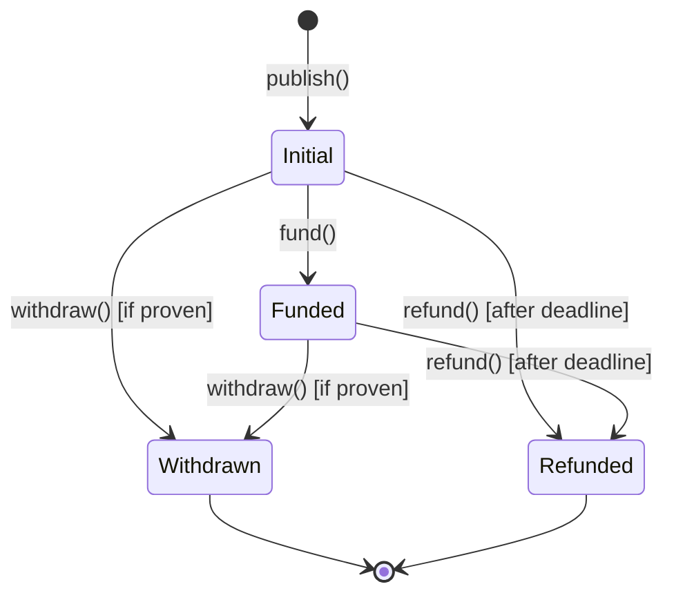

## Overview

Eco Routes Protocol implements a comprehensive security model with multiple layers of protection:

- **Vault escrow system** for isolated fund management
- **Executor safety checks** to prevent malicious calls
- **Authorization controls** limiting contract interactions
- **Lifecycle-based state management** preventing double-spends

## Vault Security

### Isolated Escrow

Each intent gets its own dedicated vault contract for fund isolation:

```solidity
// From IntentSource.sol:886-902
function _getOrDeployVault(bytes32 intentHash) internal returns (address) {
    address vault = _getVault(intentHash);
    
    return vault.code.length > 0
        ? vault
        : VAULT_IMPLEMENTATION.clone(intentHash);
}

function _getVault(bytes32 intentHash) internal view returns (address) {
    return VAULT_IMPLEMENTATION.predict(intentHash, CREATE2_PREFIX);
}
```

**Key properties:**
- **One vault per intent**: Funds cannot be mixed between intents
- **Deterministic addresses**: Vault address computed from `intentHash`
- **Minimal proxies**: Gas-efficient clones of implementation contract
- **Immutable portal**: Each vault only accepts calls from its deployer

### Portal Authorization

<Warning>
**Critical**: Only the portal contract that deployed a vault can call its functions.
</Warning>

```solidity
// From Vault.sol:19-44
contract Vault is IVault {
    /// @notice Address of the portal contract that can call this vault
    address private immutable portal;
    
    constructor() {
        portal = msg.sender;  // Set to deployer (IntentSource)
    }
    
    modifier onlyPortal() {
        if (msg.sender != portal) {
            revert NotPortalCaller(msg.sender);
        }
        _;
    }
    
    function fundFor(/* ... */) external payable onlyPortal { /* ... */ }
    function withdraw(/* ... */) external onlyPortal { /* ... */ }
    function refund(/* ... */) external onlyPortal { /* ... */ }
    function recover(/* ... */) external onlyPortal { /* ... */ }
}
```

**Security guarantees:**
- Users cannot withdraw directly from vaults
- Vaults cannot be drained by unauthorized contracts
- Portal enforces all business logic and validation

### Fund Management

#### Funding

```solidity
// From Vault.sol:46-74
function fundFor(
    Reward calldata reward,
    address funder,
    IPermit permit
) external payable onlyPortal returns (bool fullyFunded) {
    fullyFunded = address(this).balance >= reward.nativeAmount;
    
    uint256 rewardsLength = reward.tokens.length;
    for (uint256 i; i < rewardsLength; ++i) {
        IERC20 token = IERC20(reward.tokens[i].token);
        
        uint256 remaining = _fundFromPermit(
            funder,
            token,
            reward.tokens[i].amount,
            permit
        );
        remaining = _fundFrom(funder, token, remaining);
        
        fullyFunded = fullyFunded && remaining == 0;
    }
}
```

**Features:**
- **Partial funding support**: Returns whether fully funded
- **Multiple funding methods**: Standard approvals and permit-based
- **Safe transfers**: Uses OpenZeppelin's SafeERC20
- **Balance checks**: Verifies existing balance before transferring

#### Withdrawal

```solidity
// From Vault.sol:76-106
function withdraw(
    Reward calldata reward,
    address claimant
) external onlyPortal {
    uint256 rewardsLength = reward.tokens.length;
    for (uint256 i; i < rewardsLength; ++i) {
        IERC20 token = IERC20(reward.tokens[i].token);
        uint256 amount = reward.tokens[i].amount.min(
            token.balanceOf(address(this))
        );
        
        if (amount > 0) {
            token.safeTransfer(claimant, amount);
        }
    }
    
    uint256 nativeAmount = address(this).balance.min(reward.nativeAmount);
    if (nativeAmount == 0) return;
    
    (bool success, ) = claimant.call{value: nativeAmount}("");
    if (!success) {
        revert NativeTransferFailed(claimant, nativeAmount);
    }
}
```

**Safety features:**
- **Actual balance check**: Uses `min()` to prevent over-withdrawal
- **Graceful degradation**: Transfers available amount even if underfunded
- **Native ETH handling**: Safely transfers ETH with success check

#### Refund

```solidity
// From Vault.sol:108-133
function refund(Reward calldata reward, address refundee) external onlyPortal {
    uint256 rewardsLength = reward.tokens.length;
    for (uint256 i; i < rewardsLength; ++i) {
        IERC20 token = IERC20(reward.tokens[i].token);
        uint256 amount = token.balanceOf(address(this));
        
        if (amount > 0) {
            token.safeTransfer(refundee, amount);
        }
    }
    
    uint256 nativeAmount = address(this).balance;
    if (nativeAmount == 0) return;
    
    (bool success, ) = refundee.call{value: nativeAmount}("");
    if (!success) {
        revert NativeTransferFailed(refundee, nativeAmount);
    }
}
```

**Key difference from withdrawal:**
- **Full balance**: Transfers entire balance, not just reward amount
- **Emergency recovery**: Can recover funds even if partially funded

## Executor Security

### Purpose

The Executor contract safely executes arbitrary calls on behalf of intents:

```solidity
// From Executor.sol:8-15
/**
 * @title Executor
 * @notice Contract for secure batch execution of intent calls
 * @dev Implements IExecutor with comprehensive safety checks and authorization controls
 * - Only the portal contract can execute calls (onlyPortal modifier)
 * - Prevents malicious calls through EOA validation
 * - Supports batch execution for multiple calls in a single transaction
 */
contract Executor is IExecutor {
```

### Portal-Only Execution

```solidity
// From Executor.sol:17-40
contract Executor is IExecutor {
    /// @notice Address of the portal contract authorized to call execute
    address private immutable portal;
    
    constructor() {
        portal = msg.sender;  // Set during deployment by portal
    }
    
    modifier onlyPortal() {
        if (msg.sender != portal) {
            revert NonPortalCaller(msg.sender);
        }
        _;
    }
    
    function execute(
        Call[] calldata calls
    ) external payable override onlyPortal returns (bytes[] memory) {
        // ...
    }
}
```

<Warning>
**Authorization Model**: The executor is deployed by the portal contract and only accepts calls from it. This prevents unauthorized execution of calls.
</Warning>

### EOA Protection

One of the most important security features prevents calls to Externally Owned Accounts (EOAs) with calldata:

```solidity
// From Executor.sol:79-88
/**
 * @notice Checks if a call is targeting an EOA with calldata
 * @dev Returns true if target has no code but calldata is provided
 * This prevents potential phishing attacks where calldata might be misinterpreted
 * @param call The call to validate
 * @return bool True if this is a potentially unsafe call to an EOA
 */
function _isCallToEoa(Call calldata call) internal view returns (bool) {
    return call.target.code.length == 0 && call.data.length > 0;
}
```

**Why this matters:**

```solidity
// ❌ BLOCKED: Call to EOA with calldata
Call memory maliciousCall = Call({
    target: 0x742d35Cc6634C0532925a3b844Bc9e7595f0bEb,  // EOA (no code)
    value: 1 ether,
    data: hex"1234abcd"  // Some calldata
});
// Executor.execute([maliciousCall]) → Reverts with CallToEOA

// ✅ ALLOWED: Simple ETH transfer (no calldata)
Call memory ethTransfer = Call({
    target: 0x742d35Cc6634C0532925a3b844Bc9e7595f0bEb,  // EOA
    value: 1 ether,
    data: ""  // No calldata
});
// Executor.execute([ethTransfer]) → Success

// ✅ ALLOWED: Call to contract
Call memory contractCall = Call({
    target: 0xA0b86991c6218b36c1d19D4a2e9Eb0cE3606eB48,  // USDC contract
    value: 0,
    data: abi.encodeWithSignature("transfer(address,uint256)", recipient, amount)
});
// Executor.execute([contractCall]) → Success
```

### Call Execution

```solidity
// From Executor.sol:50-77
function execute(
    Call[] calldata calls
) external payable override onlyPortal returns (bytes[] memory) {
    uint256 callsLength = calls.length;
    bytes[] memory results = new bytes[](callsLength);
    
    for (uint256 i = 0; i < callsLength; i++) {
        results[i] = execute(calls[i]);
    }
    
    return results;
}

function execute(Call calldata call) internal returns (bytes memory) {
    if (_isCallToEoa(call)) {
        revert CallToEOA(call.target);
    }
    
    (bool success, bytes memory result) = call.target.call{
        value: call.value
    }(call.data);
    
    if (!success) {
        revert CallFailed(call, result);
    }
    
    return result;
}
```

**Security features:**
- **Batch execution**: All calls in a batch must succeed or entire transaction reverts
- **Return data**: Captures and returns results from each call
- **Detailed errors**: Includes failed call details in revert messages

## Lifecycle State Management

### Intent Status

```solidity
enum Status {
    Initial,    // Intent created but not funded
    Funded,     // Intent fully funded
    Withdrawn,  // Rewards withdrawn by solver
    Refunded    // Rewards refunded to creator
}
```

### State Transitions



### Validation Logic

#### Funding Validation

```solidity
// From IntentSource.sol:62-79
modifier onlyFundable(bytes32 intentHash) {
    Status status = rewardStatuses[intentHash];
    
    if (status == Status.Withdrawn || status == Status.Refunded) {
        revert InvalidStatusForFunding(status);
    }
    
    if (status == Status.Funded) {
        return;  // Allow re-funding (for partial funding)
    }
    
    _;
}
```

<Note>
**Partial Funding**: Intents can be funded multiple times until fully funded, but cannot be funded after withdrawal or refund.
</Note>

#### Withdrawal Validation

```solidity
// From IntentSource.sol:816-835
function _validateWithdraw(
    bytes32 intentHash,
    address claimant
) internal view {
    Status status = rewardStatuses[intentHash];
    
    if (status != Status.Initial && status != Status.Funded) {
        revert InvalidStatusForWithdrawal(status);
    }
    
    if (claimant == address(0)) {
        revert InvalidClaimant();
    }
}
```

**Requirements:**
- Intent must be in `Initial` or `Funded` state
- Claimant must be proven by the prover contract
- Cannot withdraw after refund

#### Refund Validation

```solidity
// From IntentSource.sol:781-814
function _validateRefund(
    bytes32 intentHash,
    uint64 destination,
    Reward calldata reward
) internal view {
    Status status = rewardStatuses[intentHash];
    IProver.ProofData memory proof = IProver(reward.prover).provenIntents(
        intentHash
    );
    
    // If proof is incorrect or no proof
    if (proof.destination != destination || proof.claimant == address(0)) {
        if (block.timestamp < reward.deadline) {
            revert InvalidStatusForRefund(
                status,
                block.timestamp,
                reward.deadline
            );
        }
        
        return;
    }
    
    if (status == Status.Initial || status == Status.Funded) {
        revert IntentNotClaimed(intentHash);
    }
}
```

**Refund conditions:**
- Deadline must have passed
- Intent must not have been proven on the correct destination
- OR intent has been withdrawn/refunded already

## Best Practices

### For Intent Creators

<Warning>
**Set Reasonable Deadlines**: Too short and legitimate solvers may not have time to fulfill. Too long and your funds are locked unnecessarily.
</Warning>

```solidity
// ✅ Good: 1 hour for cross-chain bridge
Reward memory reward = Reward({
    deadline: uint64(block.timestamp + 1 hours),
    // ...
});

// ❌ Bad: 30 seconds (too short)
Reward memory reward = Reward({
    deadline: uint64(block.timestamp + 30),
    // ...
});

// ⚠️ Risky: 7 days (funds locked too long)
Reward memory reward = Reward({
    deadline: uint64(block.timestamp + 7 days),
    // ...
});
```

### For Solvers

<Warning>
**Verify Proof Before Withdrawing**: Always ensure your fulfillment was correctly proven before attempting withdrawal.
</Warning>

```solidity
// Check proof status first
IProver.ProofData memory proof = prover.provenIntents(intentHash);

require(proof.claimant == address(this), "Not proven as claimant");
require(proof.destination == expectedDestination, "Wrong destination");

// Then withdraw
portal.withdraw(destination, routeHash, reward);
```

### For Integrators

<Warning>
**Token Approvals**: Only approve the exact amount needed for each intent. Never give unlimited approvals.
</Warning>

```solidity
// ✅ Good: Approve exact amount
token.approve(portal, intentAmount);
portal.publishAndFund(intent, false);

// ❌ Bad: Unlimited approval
token.approve(portal, type(uint256).max);
```

## Attack Vectors & Mitigations

### Double-Spend Prevention

**Attack**: Attempt to withdraw the same intent twice.

**Mitigation**: State transitions prevent this:

```solidity
// First withdrawal
portal.withdraw(destination, routeHash, reward);
// Status: Initial → Withdrawn

// Second withdrawal attempt
portal.withdraw(destination, routeHash, reward);
// ❌ Reverts: InvalidStatusForWithdrawal(Withdrawn)
```

### Vault Draining

**Attack**: Try to withdraw funds from vault directly.

**Mitigation**: `onlyPortal` modifier:

```solidity
vault.withdraw(reward, attacker);
// ❌ Reverts: NotPortalCaller(attacker)
```

### Malicious Calls

**Attack**: Include malicious calldata targeting EOAs.

**Mitigation**: EOA validation:

```solidity
Call memory attack = Call({
    target: victimEOA,
    value: 0,
    data: maliciousCalldata
});

executor.execute([attack]);
// ❌ Reverts: CallToEOA(victimEOA)
```

### Front-Running

**Attack**: See a profitable intent in mempool and try to fulfill it first.

**Mitigation**: This is actually **desirable behavior** in the protocol! Solvers compete to fulfill intents quickly, benefiting users.

<Accordion title="Can someone steal my vault funds?">
No. Vaults are isolated and can only be accessed by the portal contract. The portal enforces all business logic including proof verification before allowing withdrawals.
</Accordion>

<Accordion title="What if my intent deadline passes?">
You can call `refund()` to recover your funds from the vault. The intent status will change to `Refunded` and you'll receive all deposited tokens back.
</Accordion>

<Accordion title="Can the executor call arbitrary contracts?">
The executor can only be called by the portal, and it validates that calls don't target EOAs with calldata. However, the intent creator defines what calls are made, so choose trusted routes.
</Accordion>

<Accordion title="What happens if a vault is underfunded?">
The withdraw function uses `min()` to transfer available balance:

```solidity
uint256 amount = reward.tokens[i].amount.min(
    token.balanceOf(address(this))
);
```

Solvers receive whatever is available, but may choose not to fulfill underfunded intents.
</Accordion>

## Security Audits

<Note>
**Coming Soon**: Professional security audits will be conducted before mainnet launch. Check the documentation for updates.
</Note>

## Next Steps

<CardGroup cols={2}>
  <Card title="Deterministic Addresses" icon="fingerprint" href="/advanced/deterministic-addresses">
    Learn how CREATE2 enables secure deterministic deployments
  </Card>
  <Card title="Deposit Addresses" icon="inbox" href="/advanced/deposit-addresses">
    See how security applies to deposit address system
  </Card>
</CardGroup>