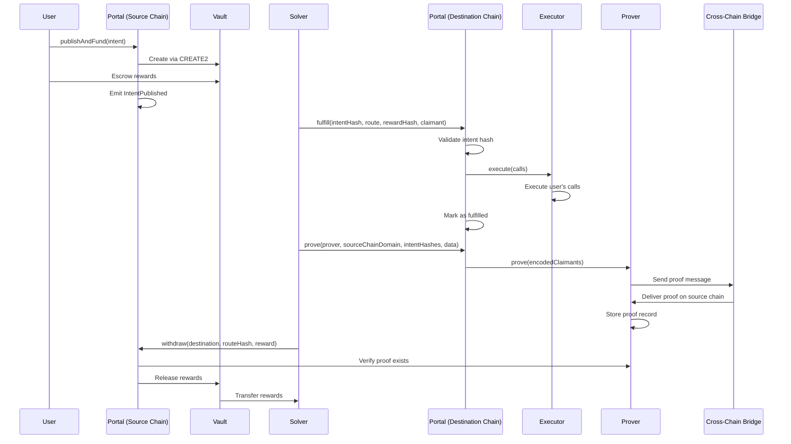

# Architecture overview

Eco Routes is built on a modular architecture that separates intent creation, fulfillment, and verification across multiple components. This design enables secure, efficient cross-chain transactions while maintaining flexibility and extensibility.

## Core components

### Portal contract

The Portal is the main entry point that combines both source and destination chain functionality. It inherits from `IntentSource` and `Inbox` to provide a unified interface.

**Location**: `contracts/Portal.sol:15`

```solidity
contract Portal is IntentSource, Inbox, Semver {
    constructor() {}
}
```

The Portal manages the complete intent lifecycle:

- **Intent creation**: Users define cross-chain operations with specific parameters
- **Intent funding**: Users escrow reward tokens in deterministic vaults
- **Intent fulfillment**: Solvers execute requested operations on destination chains
- **Proof validation**: Validates fulfillment proofs via multiple prover types
- **Reward settlement**: Distributes rewards to successful solvers

### IntentSource contract

Manages intent creation, funding, and reward settlement on the source chain.

**Location**: `contracts/IntentSource.sol:27`

<CardGroup cols={2}>
  <Card title="Key functions" icon="function">
    - `publish()` - Create and emit intent
    - `fund()` - Fund intent with reward tokens
    - `publishAndFund()` - Atomic creation and funding
    - `withdraw()` - Withdraw rewards after proof
    - `refund()` - Refund if not fulfilled before deadline
  </Card>
  <Card title="Features" icon="star">
    - Deterministic vault creation via CREATE2
    - Support for partial funding
    - Permit-based gasless approvals
    - Batch withdrawal operations
  </Card>
</CardGroup>

**Intent hashing**: `contracts/IntentSource.sol:99`

```solidity
function getIntentHash(
    Intent memory intent
) public pure returns (
    bytes32 intentHash,
    bytes32 routeHash,
    bytes32 rewardHash
) {
    routeHash = keccak256(abi.encode(intent.route));
    rewardHash = keccak256(abi.encode(intent.reward));
    intentHash = keccak256(
        abi.encodePacked(intent.destination, routeHash, rewardHash)
    );
}
```

### Inbox contract

Handles intent fulfillment on destination chains.

**Location**: `contracts/Inbox.sol:24`

<CardGroup cols={2}>
  <Card title="Key functions" icon="function">
    - `fulfill()` - Execute intent and mark as fulfilled
    - `fulfillAndProve()` - Fulfill and initiate proving in one transaction
    - `prove()` - Send proof message to source chain
  </Card>
  <Card title="Features" icon="star">
    - Intent hash validation
    - Secure call execution via Executor
    - Cross-chain message encoding
    - Excess ETH refunds
  </Card>
</CardGroup>

**Fulfillment flow**: `contracts/Inbox.sol:213`

```solidity
function _fulfill(
    bytes32 intentHash,
    Route memory route,
    bytes32 rewardHash,
    bytes32 claimant
) internal returns (bytes[] memory) {
    // Validate intent hash
    bytes32 routeHash = keccak256(abi.encode(route));
    bytes32 computedIntentHash = keccak256(
        abi.encodePacked(CHAIN_ID, routeHash, rewardHash)
    );
    
    require(computedIntentHash == intentHash, "InvalidHash");
    require(claimants[intentHash] == bytes32(0), "AlreadyFulfilled");
    
    // Mark as fulfilled
    claimants[intentHash] = claimant;
    
    // Execute calls
    return executor.execute{value: route.nativeAmount}(route.calls);
}
```

### Prover contracts

Specialized provers integrate with different cross-chain messaging protocols to verify intent fulfillment.

<CardGroup cols={2}>
  <Card title="HyperProver" icon="h">
    Uses Hyperlane for cross-chain message delivery with Interchain Security Modules (ISM).
  </Card>
  <Card title="LayerZeroProver" icon="layer-group">
    Integrates with LayerZero protocol for ultra-light node verification.
  </Card>
  <Card title="MetaProver" icon="m">
    Uses Metalayer for cross-chain proofs with their routing system.
  </Card>
  <Card title="PolymerProver" icon="p">
    Uses Polymer for IBC-based cross-chain proofs.
  </Card>
  <Card title="LocalProver" icon="server">
    Handles same-chain intents without cross-chain messaging.
  </Card>
</CardGroup>

### Vault contract

Deterministic reward escrow system created via CREATE2.

**Key features**:

- Accepts native and ERC20 token deposits
- Releases rewards to proven solvers
- Handles refunds for expired intents
- Deterministic addresses for cross-chain consistency

**Vault deployment**: `contracts/IntentSource.sol:886`

```solidity
function _getOrDeployVault(bytes32 intentHash) internal returns (address) {
    address vault = _getVault(intentHash);
    
    return vault.code.length > 0
        ? vault
        : VAULT_IMPLEMENTATION.clone(intentHash);
}
```

### Executor contract

Secure call execution system that prevents dangerous operations.

**Security features**:

- Only Portal can execute calls
- Prevents calls to EOAs (Externally Owned Accounts)
- Batch execution with comprehensive error handling
- Isolated execution context

## Architecture diagram

The following diagram shows how components interact during a complete intent lifecycle:



## Data structures

### Intent structure

**Location**: `contracts/types/Intent.sol:72`

```solidity
struct Intent {
    uint64 destination;     // Target chain ID
    Route route;           // Execution instructions
    Reward reward;         // Incentive structure
}
```

### Route structure

Defines what happens on the destination chain.

**Location**: `contracts/types/Intent.sol:39`

```solidity
struct Route {
    bytes32 salt;              // Unique identifier
    uint64 deadline;           // Execution deadline
    address portal;            // Destination portal address
    uint256 nativeAmount;      // Native tokens to send
    TokenAmount[] tokens;      // ERC20 tokens needed
    Call[] calls;             // Contract calls to execute
}
```

### Reward structure

Defines incentives for solvers.

**Location**: `contracts/types/Intent.sol:57`

```solidity
struct Reward {
    uint64 deadline;           // Fulfillment deadline
    address creator;           // Intent creator
    address prover;            // Prover contract address
    uint256 nativeAmount;      // Native token reward
    TokenAmount[] tokens;      // ERC20 token rewards
}
```

### Call structure

**Location**: `contracts/types/Intent.sol:12`

```solidity
struct Call {
    address target;    // Contract to call
    bytes data;        // ABI-encoded function data
    uint256 value;     // Native tokens to send
}
```

## Intent lifecycle

<Steps>
  <Step title="Publishing">
    Users create intents by calling `publish()` or `publishAndFund()` on the source chain Portal. The intent is emitted as an event for solvers to observe.
    
    <Info>
      Intents can be published on any chain, or not published at all. Users can disseminate intent information directly to solvers off-chain.
    </Info>
  </Step>

  <Step title="Funding">
    Users fund intents by depositing reward tokens into deterministic vaults created via CREATE2. Funding can happen during publishing, after the fact via permit signatures, or by directly transferring to the vault address.
    
    **Status**: `Initial` → `Funded`
  </Step>

  <Step title="Fulfillment">
    Solvers monitor intents and determine profitability. When ready, they call `fulfill()` on the destination chain Portal, providing the required input tokens and executing the user's desired calls.
    
    The Inbox validates the intent hash and stores the claimant identifier.
  </Step>

  <Step title="Proving">
    After fulfillment, provers send cross-chain messages back to the source chain to verify execution. Each prover type uses a different bridge protocol (Hyperlane, LayerZero, Metalayer, Polymer).
    
    The proof includes the intent hash, claimant, and destination chain ID.
  </Step>

  <Step title="Settlement">
    Once proven, solvers call `withdraw()` on the source chain Portal. The Portal verifies the proof exists and transfers rewards from the vault to the claimant.
    
    **Status**: `Funded` → `Withdrawn`
  </Step>
</Steps>

<Note>
  If an intent is not fulfilled before the deadline, users can call `refund()` to recover their escrowed rewards.
  
  **Status**: `Funded` → `Refunded`
</Note>

## Security model

Eco Routes employs multiple layers of security:

### Intent validation

- **Hash verification**: Intent hashes are computed from route and reward data to prevent tampering
- **Deadline enforcement**: Both routes and rewards have deadlines to prevent stale executions
- **Portal verification**: Routes specify which portal address should execute them

### Execution safety

- **Isolated execution**: Calls execute through a dedicated Executor contract
- **EOA protection**: Executor prevents calls to externally owned accounts
- **Token safety**: Uses OpenZeppelin's SafeERC20 for all token operations

### Bridge security

- **Multi-bridge support**: No single point of failure
- **Protocol-specific validation**: Each prover uses its bridge's native security modules
- **Proof verification**: Source chain verifies proofs before releasing rewards

### Vault security

- **Deterministic addresses**: CREATE2 ensures consistent addresses across chains
- **Status tracking**: Prevents double-withdrawal and invalid refunds
- **Access control**: Only Portal can trigger withdrawals and refunds

## Cross-VM compatibility

Eco Routes is designed to work across different virtual machine environments:

- **Bytes32 claimants**: Claimant addresses are stored as bytes32 for cross-VM compatibility
- **Encoded routes**: Routes are encoded as bytes to support non-EVM route structures
- **Chain ID prefixes**: Proof messages include chain IDs for multi-chain coordination
- **TRON support**: Special CREATE2 prefix handling for TRON networks

## Next steps

<CardGroup cols={2}>
  <Card title="Quickstart" icon="bolt" href="/quickstart">
    Create your first intent
  </Card>
  <Card title="Core concepts" icon="book" href="/concepts/intents">
    Learn about intents, vaults, and more
  </Card>
</CardGroup>