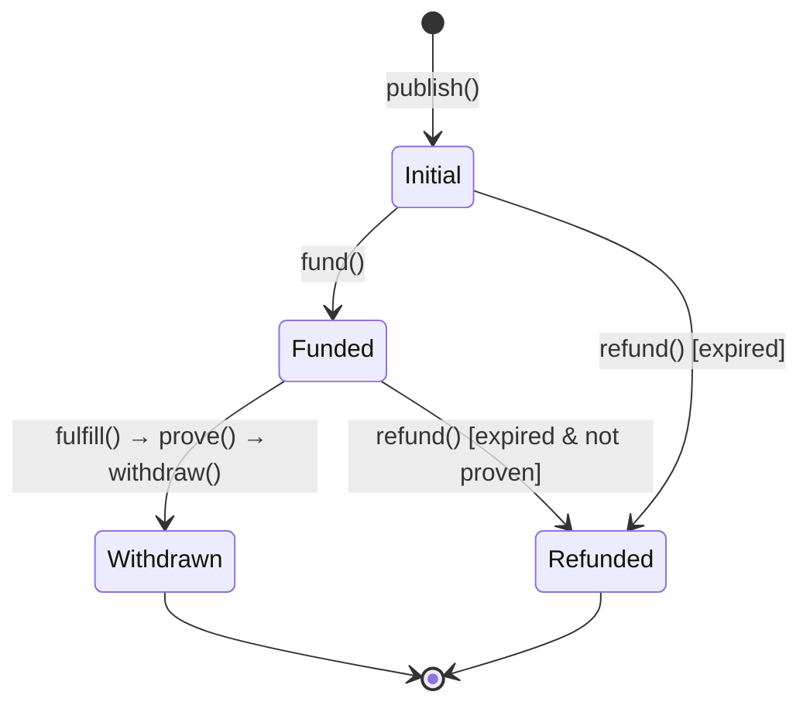

## Overview

An intent progresses through several states from creation to completion. Understanding this lifecycle is crucial for all participants in the protocol.

## Intent Status

The protocol tracks intent rewards through the following states:

```solidity
enum Status {
    Initial,    // Intent published but not funded
    Funded,     // Intent fully funded and ready for fulfillment
    Withdrawn,  // Rewards claimed by solver
    Refunded    // Rewards returned to creator (expired)
}
```

## Complete Lifecycle

<Steps>

### Step 1: Publish Intent

The user creates an intent on the source chain by calling one of the publish functions.

**Option A: Publish without funding**

```solidity
function publish(
    Intent calldata intent
) public returns (bytes32 intentHash, address vault)
```

- Creates intent with status `Initial`
- Deploys or computes vault address
- Emits `IntentPublished` event
- Returns intent hash and vault address

**Option B: Publish and fund atomically**

```solidity
function publishAndFund(
    Intent calldata intent,
    bool allowPartial
) public payable returns (bytes32 intentHash, address vault)
```

- Creates intent and funds it in one transaction
- Status changes to `Funded` if fully funded
- Emits both `IntentPublished` and `IntentFunded` events

<Note>
The intent hash is deterministic and computed as:
```
intentHash = keccak256(abi.encodePacked(destination, routeHash, rewardHash))
```
This ensures the same intent parameters always produce the same identifier.
</Note>

### Step 2: Fund Rewards

If not funded during publishing, the intent must be funded before solvers will fulfill it.

```solidity
function fund(
    uint64 destination,
    bytes32 routeHash,
    Reward calldata reward,
    bool allowPartial
) external payable returns (bytes32 intentHash)
```

**Funding process:**

1. Transfers native tokens (ETH) to vault if `msg.value` provided
2. Transfers ERC20 tokens from funder to vault based on reward.tokens
3. Updates status to `Funded` if all rewards are fully deposited
4. Emits `IntentFunded` event with completion status

**Funding validation:**

```solidity contracts/IntentSource.sol
modifier onlyFundable(bytes32 intentHash) {
    Status status = rewardStatuses[intentHash];

    if (status == Status.Withdrawn || status == Status.Refunded) {
        revert InvalidStatusForFunding(status);
    }

    if (status == Status.Funded) {
        return;
    }

    _;
}
```

- Cannot fund withdrawn or refunded intents
- Can add additional funds to partially funded intents
- Can re-fund already fully funded intents

<Info>
Users can check funding status with:
```solidity
function isIntentFunded(Intent calldata intent) public view returns (bool)
```
This verifies the vault contains all required reward tokens and native currency.
</Info>

### Step 3: Fulfill Intent

Solvers monitor for funded intents and fulfill them on the destination chain.

```solidity
function fulfill(
    bytes32 intentHash,
    Route memory route,
    bytes32 rewardHash,
    bytes32 claimant
) external payable returns (bytes[] memory)
```

**Fulfillment process:**

1. Validates the route hasn't expired: `block.timestamp <= route.deadline`
2. Verifies the intent hash matches the provided route and reward hash
3. Checks the intent hasn't already been fulfilled
4. Validates the claimant identifier is not zero
5. Stores the claimant: `claimants[intentHash] = claimant`
6. Transfers required tokens from solver to executor contract
7. Executes all calls in the route sequentially
8. Emits `IntentFulfilled` event

**Hash validation:**

```solidity contracts/Inbox.sol
bytes32 routeHash = keccak256(abi.encode(route));
bytes32 computedIntentHash = keccak256(
    abi.encodePacked(CHAIN_ID, routeHash, rewardHash)
);

if (computedIntentHash != intentHash) {
    revert InvalidHash(intentHash);
}
if (claimants[intentHash] != bytes32(0)) {
    revert IntentAlreadyFulfilled(intentHash);
}
```

**Call execution:**

The executor processes each call in sequence:

```solidity
for (uint256 i = 0; i < route.calls.length; ++i) {
    Call memory call = route.calls[i];
    // Execute: call.target.call{value: call.value}(call.data)
}
```

<Note>
Solvers must provide:
- Native tokens equal to `route.nativeAmount` (via msg.value)
- All ERC20 tokens specified in `route.tokens`
- Additional native tokens for proving if using `fulfillAndProve`

These costs are recovered through the intent's rewards after proving.
</Note>

### Step 4: Prove Fulfillment

After fulfillment, proof of execution must be transmitted to the source chain.

**Option A: Separate proving**

```solidity
function prove(
    address prover,
    uint64 sourceChainDomainID,
    bytes32[] memory intentHashes,
    bytes memory data
) public payable
```

- Can batch multiple intent proofs in one message
- More gas-efficient for high-volume solvers
- Requires separate transaction after fulfillment

**Option B: Atomic fulfill and prove**

```solidity
function fulfillAndProve(
    bytes32 intentHash,
    Route memory route,
    bytes32 rewardHash,
    bytes32 claimant,
    address prover,
    uint64 sourceChainDomainID,
    bytes memory data
) public payable returns (bytes[] memory)
```

- Fulfills and proves in one transaction
- Simpler for solvers but higher gas cost
- Ideal for low-latency scenarios

**Proving mechanism:**

1. Constructs proof message with chain ID and claimant data
2. Calls the prover contract to transmit cross-chain message
3. Prover receives message on source chain and stores proof data
4. Emits `IntentProven` event

**Cross-chain message format:**

```solidity contracts/Inbox.sol
// 8 bytes for chain ID + (32 bytes intentHash + 32 bytes claimant) per intent
bytes memory encodedClaimants = new bytes(8 + size * 64);

// Prepend chain ID
assembly {
    mstore(add(encodedClaimants, 0x20), shl(192, chainId))
}

// Pack intent hash and claimant pairs
for (uint256 i = 0; i < size; ++i) {
    bytes32 claimantBytes = claimants[intentHashes[i]];
    // Pack into encodedClaimants...
}

// Send to prover
IProver(prover).prove{value: address(this).balance}(
    msg.sender,
    sourceChainDomainID,
    encodedClaimants,
    data
);
```

<Info>
**Domain ID vs Chain ID**: The `sourceChainDomainID` parameter is NOT the same as the chain ID. Each bridge provider uses their own domain ID mapping:

- **Hyperlane**: Custom domain IDs that may differ from chain IDs
- **LayerZero**: Endpoint IDs with custom mapping
- **Metalayer**: Domain IDs specific to their routing system
- **Polymer**: Uses standard chain IDs

Consult your bridge provider's documentation for the correct domain ID.
</Info>

### Step 5: Withdraw Rewards

Once proven, anyone can withdraw rewards to the claimant on the source chain.

```solidity
function withdraw(
    uint64 destination,
    bytes32 routeHash,
    Reward calldata reward
) public
```

**Withdrawal process:**

1. Retrieves proof data from the prover contract
2. Validates the proof destination matches the intent destination
3. Verifies the claimant address is not zero
4. Checks the intent status is `Initial` or `Funded`
5. Updates status to `Withdrawn`
6. Transfers rewards from vault to claimant
7. Emits `IntentWithdrawn` event

**Proof validation:**

```solidity contracts/IntentSource.sol
IProver.ProofData memory proof = IProver(reward.prover).provenIntents(
    intentHash
);
address claimant = proof.claimant;

// If proven on different chain, challenge the proof
if (proof.destination != destination && claimant != address(0)) {
    IProver(reward.prover).challengeIntentProof(
        destination,
        routeHash,
        rewardHash
    );
    return;
}
```

**Batch withdrawals:**

```solidity
function batchWithdraw(
    uint64[] calldata destinations,
    bytes32[] calldata routeHashes,
    Reward[] calldata rewards
) external
```

Allows efficient withdrawal of multiple intents in one transaction.

<Note>
Anyone can call withdraw, but rewards always go to the claimant address stored during fulfillment. This enables:
- Permissionless reward distribution
- Third-party services that automate withdrawals
- Gas optimization through batching
</Note>

</Steps>

## Alternative Path: Refund

If an intent expires without fulfillment, the creator can recover their rewards.

### Refund Conditions

```solidity contracts/IntentSource.sol
function refund(
    uint64 destination,
    bytes32 routeHash,
    Reward calldata reward
) external
```

**Validation logic:**

```solidity
function _validateRefund(
    bytes32 intentHash,
    uint64 destination,
    Reward calldata reward
) internal view {
    Status status = rewardStatuses[intentHash];
    IProver.ProofData memory proof = IProver(reward.prover).provenIntents(
        intentHash
    );

    // If proof is incorrect or no proof
    if (proof.destination != destination || proof.claimant == address(0)) {
        if (block.timestamp < reward.deadline) {
            revert InvalidStatusForRefund(
                status,
                block.timestamp,
                reward.deadline
            );
        }
        return;
    }

    if (status == Status.Initial || status == Status.Funded) {
        revert IntentNotClaimed(intentHash);
    }
}
```

**Refund process:**

1. Checks deadline has passed: `block.timestamp >= reward.deadline`
2. Verifies intent was not proven as fulfilled
3. Updates status to `Refunded`
4. Transfers all tokens from vault back to creator
5. Emits `IntentRefunded` event

**Refund to custom address:**

```solidity
function refundTo(
    uint64 destination,
    bytes32 routeHash,
    Reward calldata reward,
    address refundee
) external
```

Only the intent creator can specify a different refund recipient.

## State Transitions



## Timeline Constraints

- **Route deadline**: Intent must be fulfilled before `route.deadline`
- **Reward deadline**: Intent must be fulfilled before `reward.deadline`
- **Refund eligibility**: Can only refund after `reward.deadline` has passed
- **Proof validity**: Proof must match the destination chain ID

<Info>
Best practice: Set `route.deadline` slightly before `reward.deadline` to give solvers time to prove fulfillment before the intent becomes refundable.
</Info>
