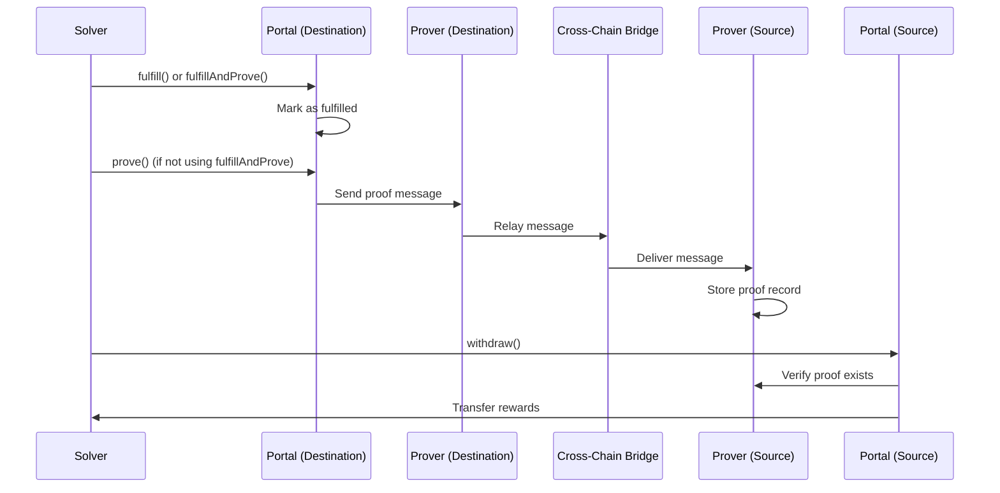

## What is Intent Proving?

After a solver fulfills an intent on the destination chain, they must **prove** the fulfillment on the source chain to claim their rewards. This proof validates that:

1. The intent was executed on the destination chain
2. The correct claimant fulfilled it
3. The execution matches the original intent hash

Eco Routes supports multiple cross-chain messaging protocols for proving, including Hyperlane, LayerZero, Polymer, and Metalayer.

## Proving Architecture



## Prover Interface

All prover contracts implement the `IProver` interface:

```solidity IProver.sol
interface IProver {
    struct ProofData {
        uint64 destination;    // Chain where intent was fulfilled
        bytes32 claimant;      // Address that fulfilled the intent
    }

    /**
     * @notice Returns proof data for an intent
     * @param intentHash Hash of the intent
     * @return proof ProofData containing destination and claimant
     */
    function provenIntents(bytes32 intentHash) external view returns (ProofData memory proof);

    /**
     * @notice Initiates proof of intent fulfillment
     * @param caller Address initiating the proof
     * @param sourceChainDomainID Domain ID for source chain
     * @param data Encoded proof data (chainId + intentHash + claimant pairs)
     * @param proverData Additional prover-specific data
     */
    function prove(
        address caller,
        uint64 sourceChainDomainID,
        bytes calldata data,
        bytes calldata proverData
    ) external payable;
}
```

## Proving Methods

There are two ways to prove intent fulfillment:

### Method 1: Fulfill and Prove Together

Use `fulfillAndProve` to atomically fulfill and initiate proving:

```solidity
// From Inbox.sol
uint64 sourceChainDomainID = getSourceDomainId(sourceChainId);
bytes memory proverData = encodeProverData(bridgeFee);

bytes[] memory results = portal.fulfillAndProve{value: totalValue}(
    intentHash,
    route,
    rewardHash,
    claimant,
    proverAddress,        // Prover on destination chain
    sourceChainDomainID,  // Bridge domain ID for source
    proverData            // Bridge-specific parameters
);
```

### Method 2: Separate Fulfill and Prove

Fulfill first, then prove separately (allows batching multiple proofs):

```solidity
// Step 1: Fulfill the intent
portal.fulfill(intentHash, route, rewardHash, claimant);

// Step 2: Batch prove multiple intents
bytes32[] memory intentHashes = new bytes32[](3);
intentHashes[0] = intentHash1;
intentHashes[1] = intentHash2;
intentHashes[2] = intentHash3;

portal.prove{value: bridgeFee}(
    proverAddress,
    sourceChainDomainID,
    intentHashes,
    proverData
);
```

## Proving Function

From `contracts/Inbox.sol`:

```solidity Inbox.sol
/**
 * @notice Initiates proving process for fulfilled intents
 * @dev Sends message to source chain to verify intent execution
 * @param prover Address of prover on the destination chain
 * @param sourceChainDomainID Domain ID of the source chain
 * @param intentHashes Array of intent hashes to prove
 * @param data Additional data for message formatting
 */
function prove(
    address prover,
    uint64 sourceChainDomainID,
    bytes32[] memory intentHashes,
    bytes memory data
) public payable;
```

This function:
1. Verifies all intents are fulfilled
2. Encodes chain ID + intent hash + claimant pairs
3. Calls the prover contract to relay the proof message

## Bridge-Specific Proving

<Tabs>
  <Tab title="Hyperlane">
    Hyperlane uses the Mailbox pattern for cross-chain messaging:

    ```solidity
    // Hyperlane domain IDs (different from chain IDs)
    uint64 ethereumDomain = 1;
    uint64 arbitrumDomain = 42161;

    // Estimate message fee
    uint256 messageFee = IMailbox(mailbox).quoteDispatch(
        ethereumDomain,
        addressToBytes32(sourceProver),
        encodedProofData
    );

    // Prove with Hyperlane
    portal.fulfillAndProve{value: route.nativeAmount + messageFee}(
        intentHash,
        route,
        rewardHash,
        claimant,
        hyperProverAddress,
        ethereumDomain,
        ""  // No additional data needed
    );
    ```
  </Tab>

  <Tab title="LayerZero">
    LayerZero uses endpoint IDs for chain identification:

    ```solidity
    // LayerZero endpoint IDs
    uint64 ethereumEndpoint = 101;
    uint64 arbitrumEndpoint = 110;

    // Encode adapter params for gas
    bytes memory adapterParams = abi.encodePacked(
        uint16(1),  // version
        uint256(200000)  // gas limit
    );

    // Estimate fee
    (uint256 nativeFee, ) = ILayerZeroEndpoint(endpoint).estimateFees(
        ethereumEndpoint,
        address(sourceProver),
        encodedProofData,
        false,
        adapterParams
    );

    // Prove with LayerZero
    portal.fulfillAndProve{value: route.nativeAmount + nativeFee}(
        intentHash,
        route,
        rewardHash,
        claimant,
        layerZeroProverAddress,
        ethereumEndpoint,
        adapterParams
    );
    ```
  </Tab>

  <Tab title="Polymer">
    Polymer uses chain IDs directly:

    ```solidity
    // Polymer uses actual chain IDs
    uint64 sourceChainId = 1;  // Ethereum

    // No additional fees needed - Polymer handles relay
    portal.fulfillAndProve{value: route.nativeAmount}(
        intentHash,
        route,
        rewardHash,
        claimant,
        polymerProverAddress,
        sourceChainId,
        ""  // No additional data
    );

    // Polymer prover emits events that are relayed
    // via IBC to the source chain
    ```
  </Tab>

  <Tab title="Metalayer">
    Metalayer uses custom domain IDs:

    ```solidity
    // Metalayer domain IDs
    uint64 sourceDomain = getMetalayerDomain(sourceChainId);

    // Estimate messaging fee
    uint256 messageFee = IMetaRouter(metaRouter).estimateFee(
        sourceDomain,
        encodedProofData
    );

    // Prove with Metalayer
    portal.fulfillAndProve{value: route.nativeAmount + messageFee}(
        intentHash,
        route,
        rewardHash,
        claimant,
        metaProverAddress,
        sourceDomain,
        ""  // No additional data
    );
    ```
  </Tab>
</Tabs>

## Claiming Rewards

After the proof is delivered to the source chain, solvers can withdraw rewards.

### Withdraw Function

From `contracts/IntentSource.sol`:

```solidity IntentSource.sol
/**
 * @notice Withdraws rewards associated with an intent to its claimant
 * @param destination Destination chain ID for the intent
 * @param routeHash Hash of the intent's route
 * @param reward Reward structure of the intent
 */
function withdraw(
    uint64 destination,
    bytes32 routeHash,
    Reward calldata reward
) public;
```

### Withdrawal Process

<Steps>
  <Step title="Wait for Proof Delivery">
    The proof must be delivered and processed on the source chain. Timing varies by bridge:

    - **Hyperlane**: 1-5 minutes typically
    - **LayerZero**: 2-10 minutes depending on confirmations
    - **Polymer**: 10-30 minutes (IBC relay)
    - **Metalayer**: 5-15 minutes

    ```javascript
    // Check if proof exists
    const proofData = await prover.provenIntents(intentHash);
    const isProven = proofData.claimant !== "0x0000000000000000000000000000000000000000000000000000000000000000";
    ```
  </Step>

  <Step title="Call Withdraw">
    Anyone can call withdraw once the proof exists:

    ```solidity
    // Calculate route hash
    bytes32 routeHash = keccak256(abi.encode(route));

    // Withdraw rewards to claimant
    intentSource.withdraw(
        destinationChainId,
        routeHash,
        reward
    );

    // Rewards are transferred from vault to claimant
    ```
  </Step>

  <Step title="Receive Rewards">
    The vault automatically transfers rewards to the claimant:

    ```solidity
    // From Vault.sol - called by withdraw()
    function withdraw(
        Reward calldata reward,
        address claimant
    ) external onlyPortal {
        // Transfer native tokens
        if (reward.nativeAmount > 0) {
            payable(claimant).transfer(reward.nativeAmount);
        }

        // Transfer ERC20 tokens
        for (uint256 i = 0; i < reward.tokens.length; i++) {
            IERC20(reward.tokens[i].token).safeTransfer(
                claimant,
                reward.tokens[i].amount
            );
        }
    }
    ```
  </Step>
</Steps>

## Complete Proving Example

Here's a complete example using Hyperlane:

```solidity
pragma solidity ^0.8.26;

import {IInbox} from "./interfaces/IInbox.sol";
import {IIntentSource} from "./interfaces/IIntentSource.sol";
import {Route, Reward, TokenAmount} from "./types/Intent.sol";
import {IMailbox} from "@hyperlane-xyz/core/contracts/interfaces/IMailbox.sol";

contract HyperlaneSolver {
    IInbox public destinationPortal;
    IIntentSource public sourcePortal;
    IMailbox public mailbox;

    address public hyperProver;
    uint64 public sourceDomain;  // Hyperlane domain for source chain

    constructor(
        address _destinationPortal,
        address _sourcePortal,
        address _mailbox,
        address _hyperProver,
        uint64 _sourceDomain
    ) {
        destinationPortal = IInbox(_destinationPortal);
        sourcePortal = IIntentSource(_sourcePortal);
        mailbox = IMailbox(_mailbox);
        hyperProver = _hyperProver;
        sourceDomain = _sourceDomain;
    }

    /**
     * @notice Fulfill and prove an intent in one transaction
     */
    function fulfillAndProveIntent(
        bytes32 intentHash,
        Route calldata route,
        bytes32 rewardHash
    ) external payable {
        // 1. Approve tokens
        for (uint256 i = 0; i < route.tokens.length; i++) {
            IERC20(route.tokens[i].token).approve(
                address(destinationPortal),
                route.tokens[i].amount
            );
        }

        // 2. Estimate Hyperlane message fee
        bytes32 claimant = bytes32(uint256(uint160(address(this))));
        bytes memory proofData = encodeProofData(
            uint64(block.chainid),
            intentHash,
            claimant
        );

        uint256 messageFee = mailbox.quoteDispatch(
            sourceDomain,
            addressToBytes32(hyperProver),
            proofData
        );

        // 3. Calculate total value needed
        uint256 totalValue = route.nativeAmount + messageFee;
        require(msg.value >= totalValue, "Insufficient value");

        // 4. Fulfill and prove
        destinationPortal.fulfillAndProve{value: totalValue}(
            intentHash,
            route,
            rewardHash,
            claimant,
            hyperProver,
            sourceDomain,
            ""  // No extra data for Hyperlane
        );
    }

    /**
     * @notice Withdraw rewards after proof is delivered
     */
    function withdrawRewards(
        uint64 destination,
        Route calldata route,
        Reward calldata reward
    ) external {
        bytes32 routeHash = keccak256(abi.encode(route));

        // This will transfer rewards to address(this)
        sourcePortal.withdraw(destination, routeHash, reward);

        // Transfer to owner or keep in contract
    }

    /**
     * @notice Helper to encode proof data
     */
    function encodeProofData(
        uint64 chainId,
        bytes32 intentHash,
        bytes32 claimant
    ) internal pure returns (bytes memory) {
        bytes memory data = new bytes(8 + 64);

        // Pack chain ID (8 bytes) + intent hash (32 bytes) + claimant (32 bytes)
        assembly {
            mstore(add(data, 0x20), shl(192, chainId))
            mstore(add(data, 0x28), intentHash)
            mstore(add(data, 0x48), claimant)
        }

        return data;
    }

    /**
     * @notice Helper to convert address to bytes32
     */
    function addressToBytes32(address addr) internal pure returns (bytes32) {
        return bytes32(uint256(uint160(addr)));
    }

    receive() external payable {}
}
```

## Batch Proving

Prove multiple intents in one transaction to save gas:

```solidity
// Fulfill intents individually
for (uint256 i = 0; i < intents.length; i++) {
    portal.fulfill(
        intentHashes[i],
        routes[i],
        rewardHashes[i],
        claimant
    );
}

// Batch prove all at once
portal.prove{value: totalBridgeFee}(
    proverAddress,
    sourceChainDomainID,
    intentHashes,  // Array of all intent hashes
    proverData
);
```

## Batch Withdrawal

Withdraw multiple rewards in one transaction:

```solidity IntentSource.sol
/**
 * @notice Batch withdraws multiple intents
 * @param destinations Array of destination chain IDs for the intents
 * @param routeHashes Array of route hashes for the intents
 * @param rewards Array of reward structures for the intents
 */
function batchWithdraw(
    uint64[] calldata destinations,
    bytes32[] calldata routeHashes,
    Reward[] calldata rewards
) external;
```

Usage:

```solidity
uint64[] memory destinations = new uint64[](3);
bytes32[] memory routeHashes = new bytes32[](3);
Reward[] memory rewards = new Reward[](3);

// Populate arrays...
destinations[0] = 42161;  // Arbitrum
destinations[1] = 10;      // Optimism
destinations[2] = 8453;    // Base

// ... set routeHashes and rewards ...

// Withdraw all at once
intentSource.batchWithdraw(destinations, routeHashes, rewards);
```

## Monitoring Proof Status

Check if a proof has been delivered:

```solidity
import {IProver} from "./interfaces/IProver.sol";

// Check proof status
IProver.ProofData memory proof = IProver(proverAddress).provenIntents(intentHash);

if (proof.claimant != bytes32(0)) {
    // Proof exists
    console.log("Intent proven on chain:", proof.destination);
    console.log("Claimant:", proof.claimant);

    // Safe to withdraw
    withdraw(destination, routeHash, reward);
} else {
    // Proof not yet delivered
    console.log("Waiting for proof...");
}
```

## Proof Challenges

If an intent is proven on the wrong destination chain, it can be challenged:

```solidity IntentSource.sol
// From withdraw() - automatically challenges invalid proofs
if (proof.destination != destination && claimant != address(0)) {
    // Challenge the proof and emit event
    IProver(reward.prover).challengeIntentProof(
        destination,
        routeHash,
        rewardHash
    );
    return;
}
```

This prevents fraudulent claims from intents fulfilled on the wrong chain.

## Important Considerations

<Warning>
  **Bridge Fees**: Always include sufficient value to cover bridge messaging fees. Insufficient fees will cause the proof to fail.
</Warning>

<Warning>
  **Domain IDs**: Different bridges use different domain ID systems. Always verify the correct domain ID for your source chain.
</Warning>

<Note>
  **Proof Timing**: Proof delivery time varies by bridge. Don't attempt withdrawal until the proof is confirmed on the source chain.
</Note>

<Tip>
  **Batch Operations**: Use batch proving and batch withdrawal to significantly reduce gas costs when handling multiple intents.
</Tip>

## Troubleshooting

### Proof Not Appearing

```solidity
// Check if proof was sent
emit IntentProven(intentHash, claimant);

// Check bridge status
// For Hyperlane: Check mailbox message status
// For LayerZero: Check endpoint message status

// Verify domain ID is correct
assert(sourceDomainID == expectedDomain);
```

### Withdrawal Reverts

```solidity
// Common issues:

// 1. Proof doesn't exist yet
require(proof.claimant != bytes32(0), "No proof");

// 2. Wrong destination
require(proof.destination == destination, "Wrong chain");

// 3. Already withdrawn
require(status != Status.Withdrawn, "Already withdrawn");
```

## Next Steps

<CardGroup cols={2}>
  <Card title="Creating Intents" icon="pen" href="/guides/creating-intents">
    Learn how users create and publish intents
  </Card>
  <Card title="Fulfilling Intents" icon="check" href="/guides/fulfilling-intents">
    Understand the fulfillment process
  </Card>
  <Card title="ERC-7683 Integration" icon="plug" href="/guides/erc7683-integration">
    Use standardized proving interfaces
  </Card>
</CardGroup>
